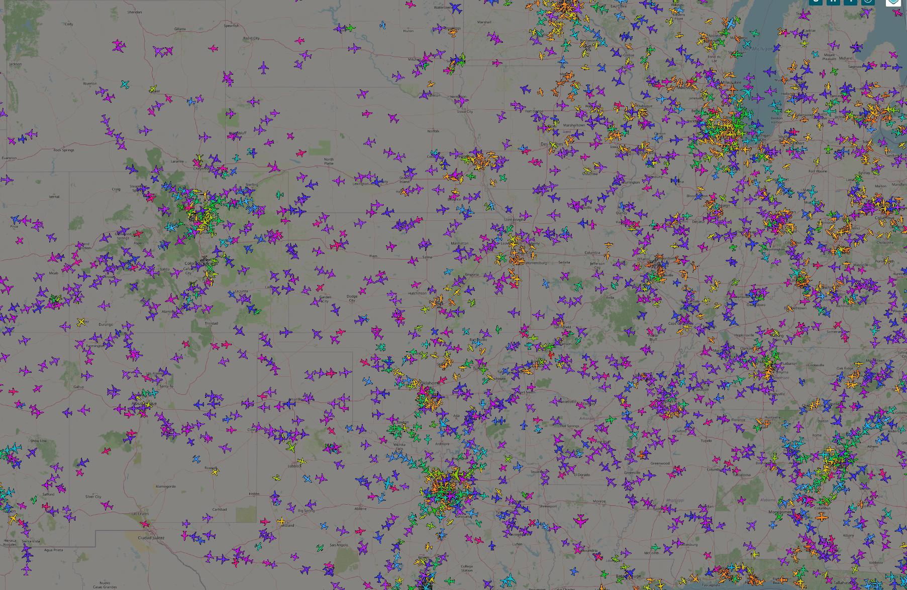
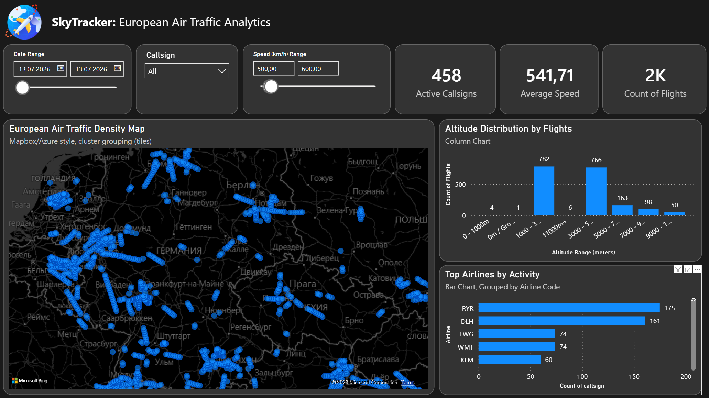

# Sky Tracker: End-to-End Flight Telemetry Pipeline & Interactive Dashboard
<div align="center">
    
[](#)
[](#)
[](#)
</div>
An end-to-end data engineering and business intelligence project designed to ingest live flight telemetry data, store and process it using DuckDB, and build an interactive geospatial flight tracking dashboard in Power BI. The pipeline automates real-time data collection, cleans and transforms raw API states via SQL, and exports optimized datasets for downstream analytical visualization.

---

## 📊 Interactive Dashboard Preview

### 1. OpenSky Network Live Map (Data Source)


### 2. Power BI Flight Radar Dashboard


---

## 🛠️ Project Architecture & Tech Stack

* **Database Management:** DuckDB (In-process analytical database for high-performance telemetry storage and SQL-based ETL processing).
* **ETL & Automation:** Python (Live OpenSky API data ingestion, state parsing, database schema mapping, and error handling).
* **Business Intelligence:** Power BI Desktop (Geospatial mapping, DAX-driven flight KPIs, and dynamic project path parameterization).

---

## 📁 Repository Structure

* **`data/`**: Subfolder containing the raw `flights.duckdb` database and the cleaned, exported `flights_export.csv` file.
* **`scripts/`**: Production Python scripts executing automated API extraction (`collector.py`) and export logic.
* **`dashboard/`**: Interactive `.pbix` dashboard with advanced data models and geospatial layouts.

---

## 🔍 Detailed Project Phases

### Phase 1: Real-Time Telemetry Ingestion (Python)

To collect aircraft telemetry data, a robust ingestion script was built in Python to interact with live flight tracking APIs:
* **API Data Processing:** Fetches active flight vectors containing key attributes: geospatial coordinates, barometric altitude, velocity, and flight callsigns.
* **State Management:** Converts unstructured API JSON payloads into clean tabular formats and appends them dynamically to the local database.
* **Resilient Path Resolution:** Implemented relative paths (`os.path`) in Python scripts to ensure the environment-agnostic execution of the pipeline across any user device.

### Phase 2: High-Performance SQL-Based ETL (DuckDB)

To prepare raw state vectors for visualization, optimized SQL-based ETL logic was structured using DuckDB's ultra-fast query engine:
* **Quality Filtering & Noise Reduction:** Implemented conditional filters to exclude flights with unidentifiable callsigns (`callsign != 'UNKNOWN'`) and missing coordinates (`latitude IS NOT NULL AND longitude IS NOT NULL`).
* **Metric In-Flight Transformation:** Dynamically converted flight speed from raw meters per second (m/s) to standardized kilometers per hour (km/h) within the SQL statement (`velocity * 3.6 AS speed_kmh`).
* **Automated CSV Export:** Utilized DuckDB's high-speed `COPY ... TO` command to compile and dump processed telemetry directly into the target analytics directory as a lightweight, pre-filtered CSV.

```sql
COPY (
    SELECT 
        timestamp,
        callsign,
        latitude,
        longitude,
        altitude_baro,
        velocity * 3.6 AS speed_kmh
    FROM flight_tracker
    WHERE callsign != 'UNKNOWN'
      AND latitude IS NOT NULL
      AND longitude IS NOT NULL
) TO '../data/flights_export.csv' (HEADER, DELIMITER ',');
```

### Phase 3: Business BI Insights & Map Visualizations

The optimized dataset was ingested into Power BI to create an interactive command center for tracking live flight paths:
* **High-Level KPI Tracking:** The dashboard instantly calculates and visualizes key metrics, including total observed flights, peak altitudes, and average velocity distributions.
* **Geospatial Mapping:** Plots real-time aircraft paths using latitude and longitude parameters, allowing users to track global flight activity dynamically.
* **Modular Project Path Parameterization:** Implemented a customizable `ProjectPath` Power Query Parameter, enabling any user to re-link the entire data model to their local directory in a single click without modifying underlying table queries.

---

## 🚀 How to Access and Run the Project

1. **Clone the Repository:**
   ```bash
   git clone [https://github.com/Kuznetsov-Mikhail9023/sky-tracker.git](https://github.com/Kuznetsov-Mikhail9023/sky-tracker.git)
   cd sky-tracker
   ```
2. **Execute Ingestion Pipeline:**
   Run the collector script to populate the database with live flight state vectors:
   ```bash
   python scripts/collector.py
   ```
3. **Run ETL & Export Clean Data:**
   Run the SQL export logic via DBeaver or Python to write the latest analytical dataset:
   ```bash
   # Generates data/flights_export.csv
   ```
4. **Launch Dashboard:**
   * Open `dashboard/sky_tracer_visual.pbix` in **Power BI Desktop**.
   * Navigate to *Transform Data* -> *Edit Parameters*.
   * Change the `ProjectPath` parameter to match your local repository directory and click *Apply Changes*.

---

## 📄 License & Data Source

* **License:** This project is open-source and licensed under the [MIT License](LICENSE).
* **Data Source:** Live flight vector data provided by the **OpenSky Network API**.
